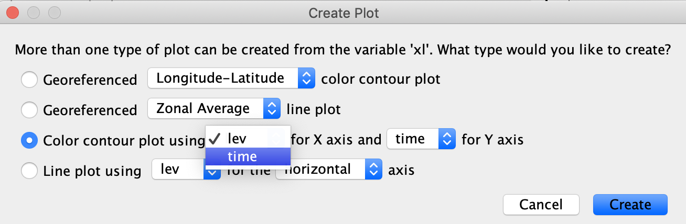
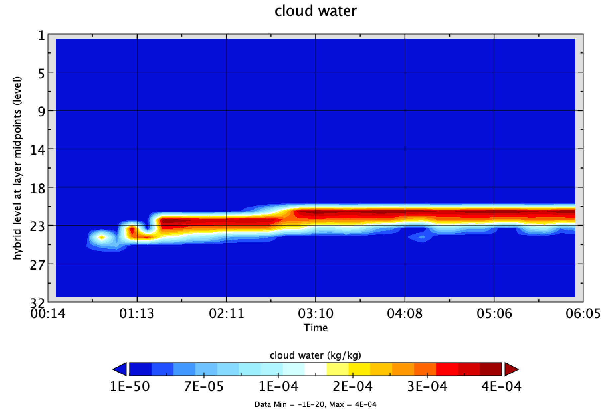
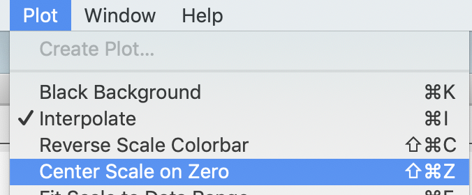
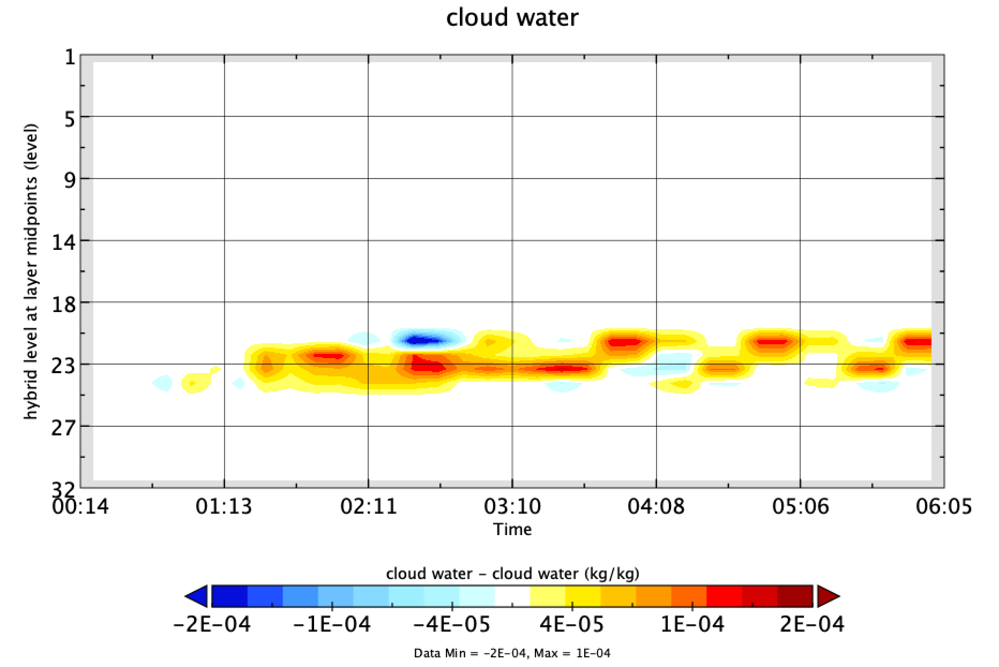
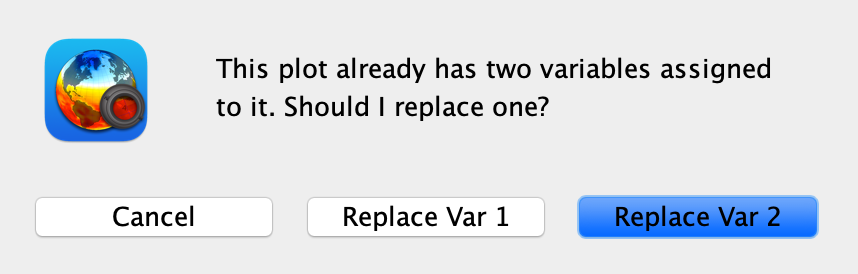
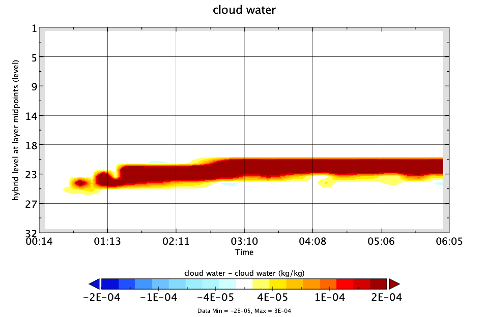

# How Does Autoconversion Impact Rain Formation in the Climate-Aerosol Model ECHAM-HAM (single column model version)?

## Preparation 

* Test (or prepare) your machine for remote connections with ssh and sshfs

* Learn vim, bash and panoply

  * View instructions on <https://github.com/diegovillanueva/SCM_workshop/blob/main/SSH_SSHFS.md> 


## EXERCISE 1: First ECHAM compilation on Mistral

* Mistral is the supercomputer at the German Climate Computer Center DKRZ. Check infos on: <https://www.dkrz.de/up/systems/mistral>

### Login into Mistral

* What you need
  * Your account number ("MyUser")
  * Your password ("MyPASSWORD")

* Log into mistral using your user and password (platform dependent)
  * In the terminal (Mac and Linux)
    
    ```	
    ssh MyUser@mistral.dkrz.de
    ```
  * With putty: 
    * follow instructions on <https://www.ssh.com/academy/ssh/putty/windows> 

#### Now on MISTRAL

* Go to your home directory

    ```
    cd ~
    ```
    
### Prepare your environment
    
* Make a variable including your project number (bb1224 for T2 course in SS2021)

    ``` 
    export ACCOUNT=bb1224
    ``` 

* Load the required modules for ECHAM-HAM
    ``` 
    module use /pf/zmaw/m222045/m222045_modulefiles
    module load jobscript_toolkit
    module load autotools_for_echam/6.3.0
    module load intel/16.0
    module load mxm/3.4.3082
    module load bullxmpi_mlx/bullxmpi_mlx-1.2.9.2
    ```

* And set the correct language
    ```
    export LC_ALL=C
    ```

* Add the lines in your ~/.bash_profile for your next session:

    ``` 
    vi ~/.bash_profile
    ```
  * On vim add
 	
  
    ``` 
    export ACCOUNT=bb1224
    module use /pf/zmaw/m222045/m222045_modulefiles
    module load jobscript_toolkit
    module load autotools_for_echam/6.3.0
    module load intel/16.0
    module load mxm/3.4.3082
    module load bullxmpi_mlx/bullxmpi_mlx-1.2.9.2
    export LC_ALL=C
    ```

    * In short: inside vim: 
      * press 'i' for insertmode, then paste the lines 
      * press 'esc' for normal mode, 
      * type ':wq' and press 'enter' to save and quit

### Download ECHAM

* Copy ECHAM-HAM to your home directory: about 5 min ( go stretch ;) )

    ```
    cp -av /work/bb1224/2021_MS-COURSE/model/MyClimateModel ~/MyClimateModel
    ```

    * if it fails due to permissions:
    ```
    cp -av /work/bb1224/userspace/b380602/MyClimateModel ~/MyClimateModel
    ```

    
### Download the Patch for Practical Work with the Single Column Model
* Download patch, configuration and boundary conditions

    ``` 
    git clone https://github.com/diegovillanueva/SCM_workshop.git
    ```

* What is on the files?
	* 'SCM_workshop/scm-patch.patch'
	* 'SCM_workshop/ioColumn.patch'
		* Patches for the source code (MyClimateModel/src/)
	* 'SCM_workshop/settings_patch_scm.generic.patch'
		* A patch for the simulation settings (MyClimateModel/my_experiments/MyRun/)
	* 'SCM_workshop/stdatm_form_diss.nc'
		* A file with boundary conditions for the SCM model.

* Patch the code for SCM
	* Go to model directory
	
    ```	
    cd ~/MyClimateModel
    ```

  * Apply source code patch

    ```
    git apply --whitespace=nowarn ~/SCM_workshop/scm-patch.patch
    patch src/mo_iocolumn.f90 ~/SCM_workshop/ioColumn.patch
    ```
    
### Compile the ECHAM Model for Fortran
* Compile and configure the model: about 30 min (make a break and grep a coffee)
	* Configure the model for this machine (only needed the first time)
		
    ```
    ./configure --with-fortran=intel
    ```

    * Compile (repeat after code changes)
	
    ```
    make -j 40    # compile files in src/
    make install  # prepare binary file (bin/echam6)
    ```

    * check compilation
    ```
    ls -la bin/
    ```

## EXERCISE 2: Running the ECHAM Single Column Model
* Make a run
	* Prepare run
    ``` 
    cd ~/MyClimateModel/my_experiments
    prepare_run.sh MyRun
    ```
	* Configure run for SCM
    ```
    cd ~/MyClimateModel/my_experiments/MyRun/
    patch settings_MyRun ../../../SCM_workshop/settings_patch_scm.generic.patch
    ```
    * Create a directory for the output and run
    ```
    mkdir /work/$ACCOUNT/userspace/$USER
    jobsubm_echam.sh settings_MyRun
    ```

* Check if is running

    ```
    squeue -u $USER
    ```

* Check the content of your results 
    ```
    cd /work/$ACCOUNT/userspace/$USER/MyRun
    ls -la
    ```

* Check the content of your results 
    * xl: Cloud Liquid Content (kg/kg)
    * relhum: Relative Humidity (%)
    ```
    cdo infon -vertmean -timmean -selname,xl,relhum MyRun_200701.01_echam.nc
    ```

### Perform Data Analysis and Plotting - On your Local Computer (open a new terminal)

* Mount mistral disk (platform dependent) 
  * In the terminal (Mac and Linux)

    ```
    MyUser=MyUser #replace right side with your user
    MyPass=MyPass #replace right side with your pass
    mkdir MISTRAL
    sshfs $MyUser@mistral.dkrz.de:/work/bb1224/userspace/$MyUser ./MISTRAL -ovolname=NAME -o password_stdin <<< "$MyPass"
    ```
  * With FileZilla (or WinSCP):
    * File -> Site Manager -> New site
      * "General" Tab
        * Protocol: SFTP
        * Host: mistral.dkrz.de
        * User: MyUser (replace)
        * Password: MyPass (replace)
      * "Advanced" Tab
        *  Default remote directory: /work/bb1224/userspace/MyUser (replace)
    * "Connect" -> yes

* Plot your results with panoply (platform dependent)

    * In the terminal (Mac and Linux)

    ```
    open MISTRAL/MyRun/MyRun_200701.01_echam.nc
    ```

    * With FileZilla:
        * Remote site: /mnt/lustre02/work/bb1224/userspace/MyUser/MyRun (replace)
            * Double click on file to download
        *  Local site:
            * Right click -> open

    * With panoply: Plot cloud water content (xl)






## EXERCISE 3: Rerunning ECHAM on MISTRAL with Parameter Changes

* Change a parameter in your simulation and rerun

    * Go to your experiment folder

    ```
    cd ~/MyClimateModel/my_experiments
    ```

    * Prepare run

    ```
    prepare_run.sh MyRunWithChanges
    ```

    * Configure run for SCM

    ```
    cd ~/MyClimateModel/my_experiments/MyRunWithChanges
    patch settings_MyRunWithChanges ../../../SCM_workshop/settings_patch_scm.generic.patch
    ```

    * Change the autoconversion scheme 

    ```
    vi settings_MyRunWithChanges
    ```
    * e.g., Change 'nauto=2' to 'nauto=1'  in line 167 
        * TIP: press "/", type 'nauto' and press 'enter' ( press 'n' repeatedly to jump to the next word)
        * or type '167' and then 'gg' to jump
        * nauto options:
            * 1:  Beheng (1994) - ECHAM5 Standard
            * 2:  Khairoutdinov and Kogan (2000)


    * Run

    ```
    jobsubm_echam.sh settings_MyRunWithChanges
    ```

### Perform Data Analysis and Plotting on your Local Computer

* Plot your results (platform dependent)

  * In the terminal (Mac and Linux)
  
      ```     
      open MISTRAL/MyRunWithChanges/MyRunWithChanges_200701.01_echam.nc
      ```

* Plot differences in cloud water content (xl)

    * On panoply: drag and drop variable from the new file into the old plot





## EXERCISE 4: Source Code Changes in ECHAM on MISTRAL

* Change a the source code in the model and recompile

    * Go to source directory

    ```
    cd ~/MyClimateModel/src
    ```
      
    * Change the cloud microphysics routine in mo_cloud_micro_2m.f90 (lines 2996 and 2932)
    
    ```
    cp mo_cloud_micro_2m.f90 mo_cloud_micro_2m.f90.back #back up
    vi mo_cloud_micro_2m.f90
    ```
    * increase autoconversion efficiency by a hundredfold
        * change 'ccraut' to '100.0_dp*ccraut' in line 2932  (subroutine for nauto=2; default) 
        * optional: also change 'ccraut' to '100.0_dp*ccraut' in line 2996  (subroutine for nauto=1) 
        * CHECK line! (botton right in VIM editor)

    * optional: check for errors
    ```
    ifort -DHAVE_YAXT -DINPUT_IN_ECHAM -DHAVE_CONFIG_INC -I/pf/b/b380602/REMO.P3.echam6.3-ham2.3-moz1.0/include -I./ -I/pf/b/b380602/REMO.P3.echam6.3-ham2.3-moz1.0/config -I/mnt/lustre01/pf/b/b380602/REMO.P3.echam6.3-ham2.3-moz1.0/cdi/src -I/sw/rhel6-x64/netcdf/netcdf_fortran-4.4.2-intel14/include -I/sw/rhel6-x64/netcdf/netcdf_c-4.3.2-gcc48/include -I/sw/rhel6-x64/sys/libaec-0.3.2-gcc48/include -I/sw/rhel6-x64/hdf5/hdf5-1.8.14-threadsafe-gcc48/include -I/sw/rhel6-x64/sys/libaec-0.3.2-gcc48/include -I/usr/include -I/mnt/lustre01/pf/b/b380602/REMO.P3.echam6.3-ham2.3-moz1.0/yaxt/inst_headers/f90 -I/opt/mpi/bullxmpi_mlx/1.2.8.3/lib -O3 -fp-model source -fast-transcendentals -no-prec-sqrt -no-prec-div -xHOST -diag-disable 15018 -DHAMMOZ -c -o mo_cloud_micro_2m.o -fpp -DWITH_LHET mo_cloud_micro_2m.f90
    ```

* Go back and back up previous binary 

    ```
    cd ~/MyClimateModel
    mv bin/echam6 bin/echam6.original
    ```
* and compile (~15 min), go grab a cup of coffee :)
    ```
    make -j 40    # compile files in src/
    make install  # prepare binary file (bin/echam6)
    echo
    ```

* Rerun and plot differences

    * Go to experiments

    ```
    cd ~/MyClimateModel/my_experiments
    ```

    * Prepare run

    ```
    prepare_run.sh MyRunWithChangesInCode
    ```
    * Configure run for SCM

    ```
    cd ~/MyClimateModel/my_experiments/MyRunWithChangesInCode
    patch settings_MyRunWithChangesInCode ../../../SCM_workshop/settings_patch_scm.generic.patch
    ```

  * Run ECHAM again
  
    ```
    jobsubm_echam.sh settings_MyRunWithChangesInCode
    ```


### Perform Data Analysis and Plotting  On your Local Computer

* Plot your results (platform dependent)

    * In the terminal (Mac and Linux)
  
    ```     
    open MISTRAL/MyRunWithChangesInCode/MyRunWithChangesInCode_200701.01_echam.nc    
    ```

* Plot differences in cloud water content (xl)

	* On panoply: drag and drop variable into plot






## EXERCISE 5: Make your own changes in ECHAM-HAM 

* Repeat exercise 2 or 3, but 
    * pick your own variable
    * settings 
    ```
    vi ~/MyClimateModel/include/physctl.inc), 
    ```
    * or change in the source code:
    ```
    vi ~/MyClimateModel/src/mo_cloud_micro_2m.f90
    ```

* Can you think of a change that will impact a certain variable in the model?

* Plot the differences!

* Examples:
    * Change the scheme for cdnc activation
        * add 'ncd_activ = 1' in settings file (below '&PHYSCTL')
            * 1: Lohmann et al. (1999) + Lin and Leaitch (1997)
            * 2: DEFAULT: Lohmann et al. (1999) + Abdul-Razzak and Ghan (2000)

    * Change the Sub-grid scale function of updraft velocities in activation scheme
        * add 'nactivpdf=1' in settings file (below '&PHYSCTL')
            * 0: DEFAULT: Mean updraft from TKE scheme without pdf
            * 1: Coupling of updraft pdf with 20 bins to TKE scheme (West et al., 2013)

* Interesting variables:
    * aprl: large scale precipitation (kg/m**2s; 1D variable)
    * q: specific humidity (kg/kg)

## EXERCISE 6: Finish up plots and interpret your results!

* Visualize and summarize the most important changes you found.

* Try to explain this changes. 

* Make a short report: Max 1 page and 2 plots.

* Present your results (~2 min)

