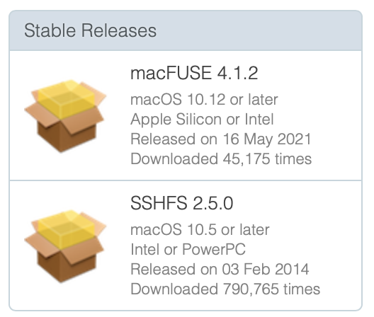
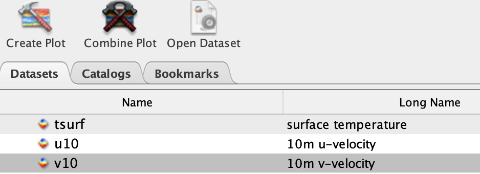
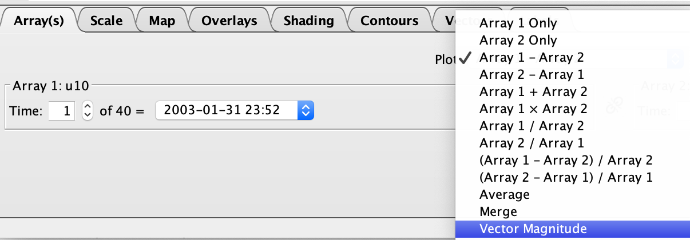
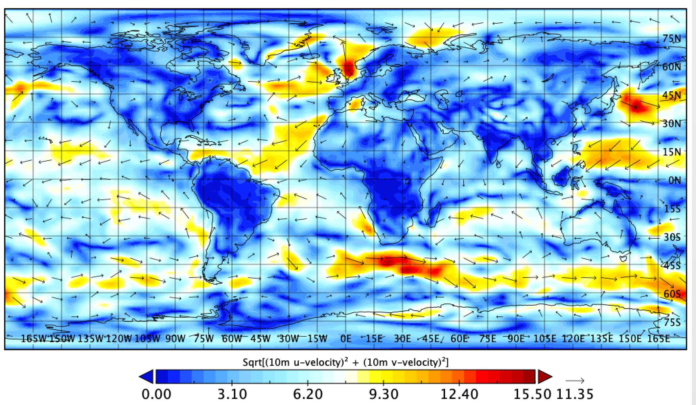

# How to access remote servers 

## Exercise #0 Install tools

### SSH: Sending commands to a remote server (Secure SHell Protocol)

#### Install using Putty, a GUI (Graphical User Interface)

- Windows
<https://www.ssh.com/academy/ssh/putty/windows>

- Linux
<https://www.ssh.com/academy/ssh/putty/linux>

- Mac
<https://www.ssh.com/academy/ssh/putty/mac>

#### Install using Terminal

- The ssh command is preinstalled on Linux and Mac


### SSHFS: Accessing files on a remote server (Secure SHell FileSystem)

#### Install using an GUI (Graphical User Interface)

<https://filezilla-project.org>

#### Install using Terminal : Linux and Mac only

- Linux (from terminal)

  ```
  sudo apt-get install sshfs
  ```

- Mac (from terminal with hombrew)

  ```
  brew install --cask osxfuse
  brew install sshfs 
  ```

- Mac (alternative)

	- Download OSXFuse and SSHFS from <https://osxfuse.github.io>



  - Install the .dmg files

### Panoply: Visualizing netcdf files

* Download in <https://www.giss.nasa.gov/tools/panoply/download/>

* Alternative on linux: ncview 

  ```
  sudo apt-get install -y ncview
  ```

## EXERCISE #1 SSH :First login on Mistral (~5min)

### Login into Mistral (**local**)

* What you need
  * Your account number ("MyUser")
  * Your password ("MyPASSWORD")

* Log into mistral using your user and password (platform dependent)
  * In the terminal (Mac and Linux)
    
      ```	
      ssh MyUser@mistral.dkrz.de # replace MyUser
      ```
  * With putty: 
    * follow instructions in <https://www.ssh.com/academy/ssh/putty/windows> 

#### Now on MISTRAL (**remote**)

* Write a note

  ```
  echo "My First Note" > note.txt
  cat note.txt
  ```
* Copy a netcdf file to your home directory, and check

  ```
  cp /work/bb1224/userspace/b380602/ECHAM.climatology.2003_2012.nc ~/
  ls -la 
  ```

## EXERCISE #2 SSHFS: First disk mount from Mistral (~5min)

### On a new terminal (**local**) 

* In the terminal (Mac and Linux)

    ```
    MyUser=MyUser #replace right side with your user
    MyPass=MyPass #replace right side with your pass
    mkdir MISTRAL
    sshfs $MyUser@mistral.dkrz.de: ./MISTRAL -ovolname=NAME -o password_stdin <<< "$MyPass"
    ```

  * Read note
  
      ```
      cat MISTRAL/note.txt
      ```
  * Open netcdf file
  
      ```
      open MISTRAL/ECHAM.climatology.2003_2012.nc
      ```

* With FileZilla: 
  * Connect
    * File -> Site Manager -> New site
      * "General" Tab
        * Protocol: SFTP
        * Host: mistral.dkrz.de
        * User: MyUser (replace)
        * Password: MyPass (replace)
      * "Connect" -> yes
  
  * Read note
  
    * On **Local** site (left side of window):  
      * Make and enter a directory (e.g, "MISTRAL") where you will download **remote** files
      
    * On **Remote** site (right side of window):  
      * Search "note.txt"
        * Double click -> Open from **local** site (left side of window)
        * or: Right click -> View/edit
  
  * Open netcdf file
    * On **Remote** site (right side of window):  
      * Search "ECHAM.climatology.2003_2012.nc"
        * Double click -> Open from **local** site (left side of window)
        * or: Right click -> View/edit
      
## EXERCISE #3 Panoply: Plot a netcdf file (~5  to 30min)

### Find tutorials in <https://www.giss.nasa.gov/tools/panoply/help/> (First 3 videos, 3 min each)

* If you completed excercise 2, then "ECHAM.climatology.2003_2012.nc" is already open with panoply

* Plot "aclcov" variable (total cloud cover)
  * Double click on variable 
  * make a Lat-Lon map
  * make a zonal average plot
  * make a latitude-time contour plot (Hovmöller diagram) 

Plot wind "u10" and "v10" variables 
* combine variables in the same plot



* plot a map with the difference u10 - v10 ("arrays")

* plot a map with the vector magnitude ("arrays")





## EXERCISE #4 VIM: Change a text file (~5 to 60 min)


### Learn vim if you haven't, for example:

* My recommendation: **vimtutor** (~30 min practical tutorial)
  * just type 
      
    ```
    vimtutor 
    ```

  * in the terminal and press enter.
  * Follow at least until Lesson 4.2  
      
* Alternatives:
  * <https://www.openvim.com> 
  * <http://www.vimgenius.com/lessons/vim-intro>
  * <https://vim-adventures.com>

### on MISTRAL

* copy a template file to your current folder and open it

  ```
  cp /work/bb1224/userspace/b380602/namelist.echam ./
  vi namelist.echam
  ```
  
* now on vim, use the search function and search for

  ```
  nauto          = 2
  ```
* and change it to

  ```
  nauto          = 1
  ```
* save and check

## EXERCISE #5 BASH: Learn the basic commands

<https://www.educative.io/blog/bash-shell-command-cheat-sheet>
